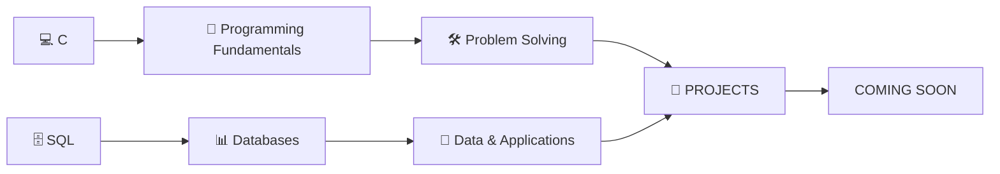

<div align="center">

# ⚡ SUYASH

### `B.Tech CSE Student` · `Developer in Progress` · `Builder`


<br><br>


</div>

---

## 🧑‍💻 `WHO AM I?`

I'm **Suyash**, a first-year **B.Tech Computer Science student** interested in understanding how software works and building things from scratch.

Currently, I'm focused on strengthening my programming fundamentals and exploring the foundations of software development.

```text
┌──────────────────────────────────────────────────────┐
│                    SUYASH.EXE                        │
├──────────────────────────────────────────────────────┤
│                                                      │
│  🎓 Role        → B.Tech CSE Student                 │
│  💻 Current     → C Programming                      │
│  🗄️ Exploring   → SQL & Databases                    │
│  🔧 Tools       → Git & GitHub                        │
│  🌱 Status      → Learning & Building                 │
│  🚀 Next        → Projects Coming Soon                │
│                                                      │
└──────────────────────────────────────────────────────┘
```

---

## 🧠 CURRENTLY LEARNING



### 💻 C Programming

```text
████████████████░░░░  80%
```

Working on:
- Variables & Data Types
- Operators
- Conditions
- Loops
- Functions
- Arrays
- Pointers
- Programming Logic

### 🗄️ SQL & Databases

```text
██████████░░░░░░░░░░  50%
```

Exploring:
- SQL Fundamentals
- Queries
- Tables
- Relationships
- CRUD Operations
- Database Design
- Data Management

---

# 🚀 PROJECT PIPELINE

```text
                         ┌──────────────┐
                         │   💡 IDEA    │
                         └──────┬───────┘
                                ↓
                         ┌──────────────┐
                         │  📚 LEARN    │
                         └──────┬───────┘
                                ↓
                         ┌──────────────┐
                         │  💻 CODE     │
                         └──────┬───────┘
                                ↓
                         ┌──────────────┐
                         │  🛠️ BUILD    │
                         └──────┬───────┘
                                ↓
                         ┌──────────────┐
                         │  🔧 GIT      │
                         └──────┬───────┘
                                ↓
                         ┌──────────────┐
                         │  🧪 TEST     │
                         └──────┬───────┘
                                ↓
                         ┌──────────────┐
                         │  🚀 SHIP     │
                         └──────┬───────┘
                                ↓
                         ┌──────────────┐
                         │  📈 IMPROVE  │
                         └──────┬───────┘
                                │
                                └──────────↻
```

---

## 📦 PROJECT STATUS

| Project | Tech | Status |
|---|---|---|
| 🌌 3D Portfolio | HTML · CSS · JS | 🟢 Live |
| 💻 C Projects | C | 🟡 Learning |
| 🗄️ Database Projects | SQL | 🟡 Learning |
| 🚀 Next Project | — | 🔵 Coming Soon |

> **More projects are coming as I learn and build.**

---

## 🧮 THE MATRIX

```text
       C
       │
       ├───────────────┐
       ↓               ↓
  PROGRAMMING      LOGIC
       │               │
       └───────┬───────┘
               ↓
         PROBLEM SOLVING
               │
               ↓
       ┌───────┴────────┐
       ↓                ↓
     SQL            DATABASES
       │                │
       └───────┬────────┘
               ↓
          PROJECTS 🚀
               │
               ↓
         REAL-WORLD CODE
```

---

## 🛠️ LANGUAGES & TOOLS

<div align="center">


</div>

---

## 📊 GITHUB

<div align="center">


<br>


<br>


</div>

---

## 🎧 CODING + MUSIC

<div align="center">

<a href="https://open.spotify.com/">


</a>

<br><br>

`FOCUS → CODE → MUSIC → REPEAT`

</div>

---

## 🌐 3D PORTFOLIO

My personal portfolio is designed around a **cinematic 3D experience** with smooth animations and a responsive UI.

### Features

- 🌌 3D animated environment
- ⚡ Smooth interactions
- 📱 Mobile responsive
- 🖥️ Desktop optimized
- 🌗 Day / Night mode
- 🎨 Multiple accent themes
- 💾 Persistent theme preferences
- 🚀 GitHub integration

<div align="center">

<a href="https://s4yush.github.io/my-portfolio/">


</a>

<a href="https://github.com/s4yush/my-portfolio">


</a>

</div>

---

## 🐍 CONTRIBUTION GRAPH

<div align="center">


</div>

---

## 🎯 2026 ROADMAP

```text
                     2026
                       │
          ┌────────────┼────────────┐
          ↓            ↓            ↓
        💻 C         🗄️ SQL       🔧 Git
          │            │            │
          └────────────┼────────────┘
                       ↓
                  🧠 DSA BASICS
                       │
                       ↓
                 🛠️ BUILD PROJECTS
                       │
                       ↓
                  🚀 SHIP PROJECTS
                       │
                       ↓
                 📈 KEEP IMPROVING
```

---

## 🧩 BUILDING MINDSET

```python
while True:
    learn()
    practice()
    build()
    break_things()
    fix_them()
    improve()
```

---

<div align="center">

# 🚀

### `LEARN • BUILD • SHIP • REPEAT`

**More projects coming soon.**

</div>
