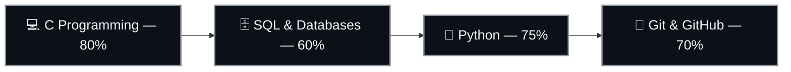
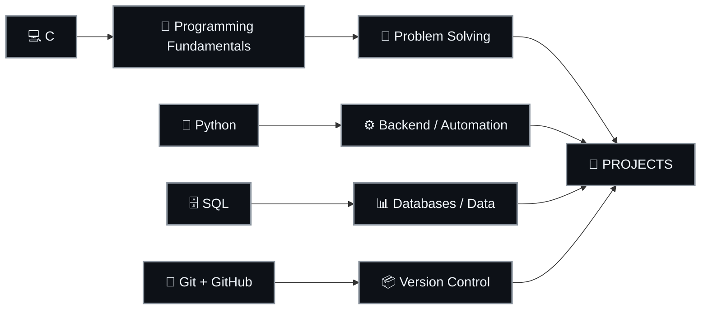
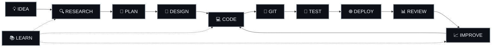
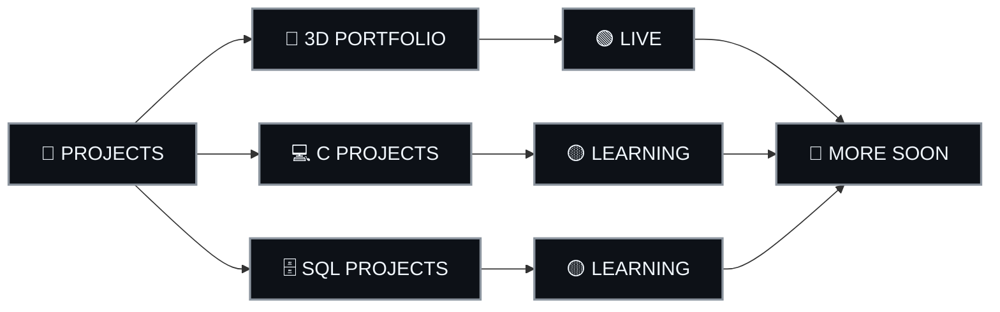
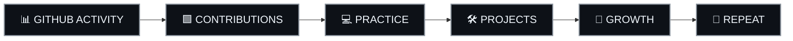
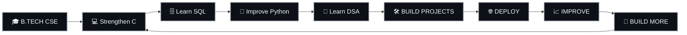

# Hi, I'm Suyash Singh 👋

### `B.Tech CSE Student` · `Developer in Progress` · `Builder`

---

## 🧑‍💻 About Me

I'm **Suyash Singh**, a first-year **B.Tech CSE student** interested in Computer Science, software development and building projects while learning.

---

## 🧠 CURRENTLY LEARNING

---

## 🛠️ LANGUAGES & TOOLS

---

## 🚀 DEVELOPMENT FLOW

---

## 📦 PROJECTS

### 🌌 3D Portfolio

A cinematic portfolio focused on **3D animation, smooth interactions, responsive UI/UX, day/night mode and four accent color themes**.

**Live:** https://s4yush.github.io/my-portfolio/

**Source:** https://github.com/s4yush/my-portfolio

### 💻 C Projects

Currently building programming fundamentals and problem-solving projects in C.

### 🗄️ SQL & Database Projects

Exploring SQL, relational data and database concepts.

> 🚀 **More projects coming soon.**

---

## 📊 GITHUB ACTIVITY

---

## ⏱️ WAKATIME

<!--START_SECTION:waka-->
<!--END_SECTION:waka-->

> Coding activity can be updated automatically using WakaTime + GitHub Actions.

---

## 🐍 CONTRIBUTION ACTIVITY

---

## 🎯 2026 ROADMAP

---

## 🎧 CODING MODE

---

## 🔗 CONNECT WITH ME

---

### 🚀 `LEARN → BUILD → SHIP → IMPROVE`

**More projects coming soon.**

